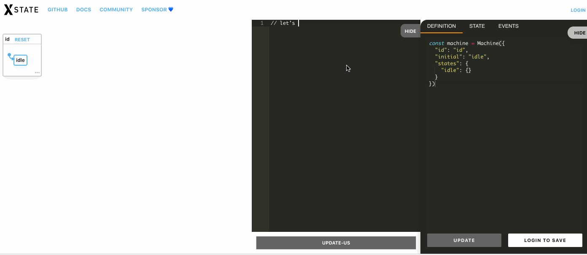

This is a chrome extension which adds an editor to [https://xstate.js.org/viz](https://xstate.js.org/viz). The editor allows writing statecharts in simpler textual language similar to [https://sketch.systems/](https://sketch.systems/).



To use the extension, clone this repository and load it as unpacked extension in chrome. 

Instruction on how to load an unpacked extension in chrome can be found here - https://webkul.com/blog/how-to-install-the-unpacked-extension-in-chrome/.


To setup a development environement - 

```
npm install
npm run build -- --watch
```

Now changes made to `content.js` will be compiled to `dist/content.js` which is then used inside the chrome extension (check `manifest.json`).

You can see your changes by reloading the extension from chromes extension page. You can go to chromes extension page by typing `chrome://extensions` in the url bar.

If you don't like reloading the extension manually on every change, you can install this awesome extension, called [Chrome Unpacked Extension Auto Reload](https://chrome.google.com/webstore/detail/chrome-unpacked-extension/fddfkmklefkhanofhlohnkemejcbamln) which does it for you - https://chrome.google.com/webstore/detail/chrome-unpacked-extension/fddfkmklefkhanofhlohnkemejcbamln.

To test changes to the parser, you can write tests in `parser/parser.test.js` and run `npm run test -- --watch` to run the tests.
