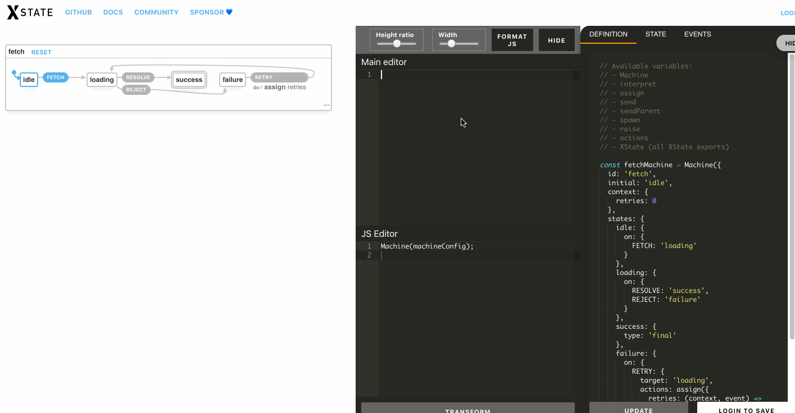

This is a chrome extension which adds an editor to [https://xstate.js.org/viz](https://xstate.js.org/viz). The editor allows writing statecharts in simpler textual language similar to [https://sketch.systems/](https://sketch.systems/).



To use the extension, clone this repository and load it as unpacked extension in chrome. 

Instruction on how to load an unpacked extension in chrome can be found here - https://webkul.com/blog/how-to-install-the-unpacked-extension-in-chrome/.

E.g. statechart representation in the textual langauge 

```
% statechart for autocomplete. This is a comment.
% a single word in a line signifies a state
% indented lines inside state signify the transitions inside the state
% one line for each transition
% A transition has the following format - eventName -> stateName
% There can also be a transition without an event. They are called transient
% transitions. They can be specified without specifying the event name in the
% normal transition syntax. E.g. `-> stateName` 
% You can specify the type of state by adding some special character
% at the end of the state name
% * -> initial state
% $ -> final state
% & -> parallel state
% A condition for a transition can be specified by using the semicolon 
% actions to be run on a transition can be specified by using a >. E.g. EVENT -> state > action1 > action2
% separator. Look at the third transition in `match` state for example.
% what about a syntax where the conditions/actions can be specified by another
% indented line after the transtion and some specifiers like c: and a: for
% conditions and actions?
% state names and transition names cannot have spaces in them
% Only accepted characters are a-z, A-Z, #, ., 0-9, _
autocomplete
    blur* % This is an initial state
        FOCUS -> focused
    focused
        BLUR -> blur
        MOUSE_CLICK_OUTSIDE -> blur
        CHANGE_TEXT -> focused.match
        % below is a transient state
        match*
            -> list_hidden; shouldHideList
            -> list.non_empty; matches
            -> list.empty; doesNotMatch > performThisAction
        list_hidden$
        list
            empty
            non_empty
                ARROW_KEY -> non_empty.selected
                MOUSE_CLICK_ITEM -> #autocomplete.focused
                not_selected*
                selected
                  ENTER_KEY -> #autocomplete.focused
```

To setup a development environement - 

```
npm install
npm run build -- --watch
```

Now changes made to `content.js` will be compiled to `dist/content.js` which is then used inside the chrome extension (check `manifest.json`).

You can see your changes by reloading the extension from chromes extension page. You can go to chromes extension page by typing `chrome://extensions` in the url bar.

If you don't like reloading the extension manually on every change, you can install this awesome extension, called [Chrome Unpacked Extension Auto Reload](https://chrome.google.com/webstore/detail/chrome-unpacked-extension/fddfkmklefkhanofhlohnkemejcbamln) which does it for you - https://chrome.google.com/webstore/detail/chrome-unpacked-extension/fddfkmklefkhanofhlohnkemejcbamln.

To test changes to the parser, you can write tests in `parser/parser.test.js` and run `npm run test -- --watch` to run the tests.
